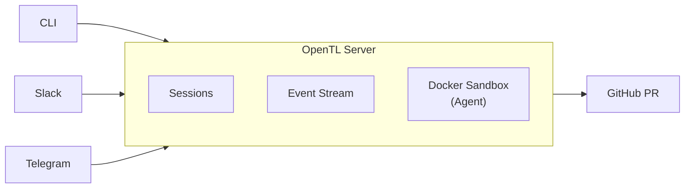

<div align="center">

# OpenTL

**Open Tech Lead** — a background coding agent for engineering teams.

Send a task. Get a PR.

[](https://go.dev)
[](LICENSE)
[](https://docs.docker.com/get-docker/)

</div>

---

```
opentl run "add rate limiting to /api/users" --repo myorg/myapp
# ...agent works in background...
# -> PR #142 opened: https://github.com/myorg/myapp/pull/142
```

## How It Works

1. You send a task — via **CLI**, **Slack**, or **Telegram**
2. OpenTL spins up an **isolated Docker sandbox** with your repo
3. A coding agent works on the task — [Claude Code](https://docs.anthropic.com/en/docs/claude-code), [Codex](https://openai.com/index/codex/), or [OpenCode](https://opencode.ai/)
4. Changes are committed, pushed, and a **PR is opened**
5. You review the PR



## Quick Start

### Prerequisites

- [Go 1.22+](https://go.dev/dl/)
- [Docker](https://docs.docker.com/get-docker/)
- A GitHub personal access token ([create one](https://github.com/settings/tokens) with `repo` scope)
- An LLM API key — `ANTHROPIC_API_KEY` or `OPENAI_API_KEY`

### Install

```bash
go install github.com/jxucoder/opentl/cmd/opentl@latest
```

Or build from source:

```bash
git clone https://github.com/jxucoder/opentl.git
cd opentl
make build
```

### Setup

```bash
# Set required environment variables
export GITHUB_TOKEN="ghp_..."
export ANTHROPIC_API_KEY="sk-ant-..."   # or OPENAI_API_KEY

# Build the sandbox Docker image
make sandbox-image
```

### Run

```bash
# Start the server
opentl serve

# In another terminal — run a task
opentl run "fix the typo in README.md" --repo yourorg/yourrepo

# List sessions
opentl list

# Check a session's status
opentl status <session-id>

# Stream logs
opentl logs <session-id> --follow
```

### Docker Compose (fully containerized)

```bash
# Configure tokens
cp .env.example .env
# Edit .env with your tokens

# Start everything
make docker-up

# Run tasks against the server
opentl run "your task" --repo owner/repo --server http://localhost:7080
```

> See [docs/deploy.md](docs/deploy.md) for a full VPS deployment guide.

## Architecture

OpenTL is a single binary — `opentl serve` runs the server, `opentl run` talks to it.

| Component | Description |
|:----------|:------------|
| **Server** | Go HTTP server. Manages sessions, streams events via SSE, creates PRs. |
| **Sandbox** | One Docker container per task. Clones the repo, runs the coding agent (Claude Code, Codex, or OpenCode), pushes a branch. |
| **CLI** | Creates sessions, streams logs, checks status. |
| **Slack / Telegram** | Bot integrations — send tasks from chat, get PR links back. |
| **Web UI** | React + Vite dashboard for monitoring sessions. |

### API

| Method | Endpoint | Description |
|:-------|:---------|:------------|
| `POST` | `/api/sessions` | Create a session |
| `GET` | `/api/sessions` | List sessions |
| `GET` | `/api/sessions/:id` | Get session details |
| `GET` | `/api/sessions/:id/events` | SSE stream of events |
| `POST` | `/api/sessions/:id/stop` | Stop a session |
| `GET` | `/health` | Health check |

## Configuration

All configuration is via environment variables:

| Variable | Required | Default | Description |
|:---------|:---------|:--------|:------------|
| `GITHUB_TOKEN` | Yes | — | GitHub personal access token |
| `ANTHROPIC_API_KEY` | One of these | — | Anthropic API key |
| `OPENAI_API_KEY` | One of these | — | OpenAI API key |
| `OPENTL_ADDR` | No | `:7080` | Server listen address |
| `OPENTL_DATA_DIR` | No | `~/.opentl` | Data directory for SQLite DB |
| `OPENTL_DOCKER_IMAGE` | No | `opentl-sandbox` | Sandbox Docker image |
| `OPENTL_DOCKER_NETWORK` | No | `opentl-net` | Docker network name |
| `OPENTL_SERVER` | No | `http://localhost:7080` | Server URL (for CLI) |

## Project Structure

```
OpenTL/
├── cmd/opentl/           CLI + server entry point
├── internal/
│   ├── config/           Configuration from environment
│   ├── decomposer/       Multi-step task decomposition
│   ├── github/           GitHub API (PR creation)
│   ├── indexer/          Repo-aware context indexing
│   ├── orchestrator/     LLM-driven planning layer
│   ├── sandbox/          Docker container lifecycle
│   ├── server/           HTTP API, session orchestration, SSE
│   ├── session/          Session model, SQLite store, event bus
│   ├── slack/            Slack bot integration
│   └── telegram/         Telegram bot integration
├── docker/
│   ├── base.Dockerfile   Sandbox image (Ubuntu + Node + Python + Go + agents)
│   ├── server.Dockerfile Server image (minimal Alpine)
│   ├── compose.yml       Docker Compose for local dev
│   ├── entrypoint.sh     Sandbox entrypoint script
│   └── setup.sh          Sandbox setup script
├── web/                  React + Vite dashboard
└── docs/                 Deployment & setup guides
```

## Roadmap

### Phase 1 — MVP (current)

- [x] Server with REST API and SSE streaming
- [x] Docker sandbox with pluggable agents (Claude Code, Codex, OpenCode)
- [x] CLI (`run`, `list`, `status`, `logs`)
- [x] GitHub PR creation
- [x] Slack bot integration
- [x] Telegram bot integration
- [x] Web UI (React + Vite)

### Phase 2 — Intelligence

- [ ] Plan-then-code-then-review prompt chain
- [ ] Repo-aware context indexing
- [ ] Multi-step task decomposition

### Phase 3 — Scale

- [ ] Sandbox pre-warming and caching
- [ ] Modal / cloud sandbox provider
- [ ] Multiplayer sessions
- [ ] Kubernetes Helm chart

## Documentation

| Guide | Description |
|:------|:------------|
| [Getting Started](docs/getting-started.md) | First-time setup walkthrough |
| [Deployment](docs/deploy.md) | VPS deployment with Docker Compose |
| [Slack Setup](docs/slack-setup.md) | Connect your Slack workspace |
| [Telegram Setup](docs/telegram-setup.md) | Set up the Telegram bot |

## License

Apache 2.0 — see [LICENSE](LICENSE).
