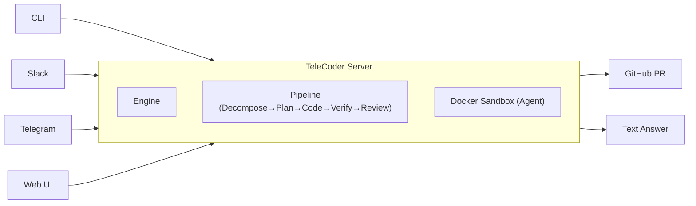

<div align="center">

# TeleCoder

**An extensible background coding agent framework for engineering teams.**

Send a task. Get a PR — or a direct answer.

[](https://go.dev)
[](LICENSE)
[](https://docs.docker.com/get-docker/)

</div>

---

```
telecoder run "add rate limiting to /api/users" --repo myorg/myapp
# -> PR #142 opened: https://github.com/myorg/myapp/pull/142

telecoder run "what testing framework does this project use?" --repo myorg/myapp
# -> Done: This project uses Jest for unit tests and Playwright for e2e tests.
```

Ask anything — features, bug fixes, refactors, questions, code reviews, security audits. If the agent changes code, you get a PR. If not, you get a direct answer.

## How It Works

1. You send a task — via **CLI**, **Slack**, **Telegram**, or **Web UI**
2. TeleCoder spins up an **isolated Docker sandbox** with your repo
3. A coding agent works on the task — [OpenCode](https://opencode.ai/), [Claude Code](https://docs.anthropic.com/en/docs/agents-and-tools/claude-code/overview), or [Codex](https://openai.com/index/codex/). The sandbox ships with all three, so the agent can invoke other agents as CLI tools when needed.
4. If code was changed → commits, pushes, and a **PR is opened**; if no code changes → returns a **text answer** directly
5. You review the PR (or read the answer)



## Why TeleCoder

TeleCoder is built for teams that want the speed of AI coding without turning every task into manual copy-paste and local prompt wrangling.

- **Flexible output** — code tasks produce PRs; questions and analysis tasks return text answers directly. The agent decides.
- **Stay in your normal workflow** — submit tasks from CLI, Slack, or Telegram and review real PRs in GitHub.
- **Protect your development environment** — every task runs in an isolated Docker sandbox instead of your local machine.
- **Keep quality guardrails** — optional plan/review stages and revision loops reduce low-quality one-shot outputs.
- **Scale beyond a single bot** — run multiple sessions in parallel, track status, and stream logs/events.
- **Own your architecture** — TeleCoder is a framework, so you can swap LLMs, sandboxes, stores, git providers, and channels.

If you just want to run tasks and get PRs (or text answers), use the CLI and defaults.
If you want to build a custom coding-agent product, import TeleCoder as a Go library.

## For Builders

TeleCoder is also a **pluggable Go framework**. You can import it as a library and swap core components (LLM, sandbox, store, git provider, pipeline, channels).

See [docs/reference.md](docs/reference.md) for:
- builder examples
- core interfaces
- architecture breakdown
- API endpoints
- configuration reference
- project structure and roadmap

## Quick Start

### Prerequisites

- [Go](https://go.dev/dl/) (version compatible with `go.mod`)
- [Docker](https://docs.docker.com/get-docker/)
- A GitHub personal access token ([create one](https://github.com/settings/tokens) with `repo` scope)
- An LLM API key — `ANTHROPIC_API_KEY` or `OPENAI_API_KEY`

### 1. Install

```bash
go install github.com/jxucoder/TeleCoder/cmd/telecoder@latest
```

Or build from source:

```bash
git clone https://github.com/jxucoder/TeleCoder.git
cd TeleCoder
make build
```

### 2. Configure

The interactive setup wizard writes tokens to `~/.telecoder/config.env`:

```bash
telecoder config setup
```

Or set environment variables directly:

```bash
export GITHUB_TOKEN="ghp_..."
export ANTHROPIC_API_KEY="sk-ant-..."   # or OPENAI_API_KEY
```

You can also copy the example file and edit it:

```bash
cp .env.example .env
```

**Required:**

| Variable | Description |
|:---------|:------------|
| `GITHUB_TOKEN` | GitHub personal access token with `repo` scope |
| `ANTHROPIC_API_KEY` | Anthropic API key — at least one LLM key is required |
| `OPENAI_API_KEY` | OpenAI API key — at least one LLM key is required |

**Optional:**

| Variable | Default | Description |
|:---------|:--------|:------------|
| `TELECODER_ADDR` | `:7080` | Server listen address |
| `TELECODER_DOCKER_IMAGE` | `telecoder-sandbox` | Sandbox Docker image name |
| `TELECODER_MAX_REVISIONS` | `1` | Max review/revision rounds per sub-task |
| `TELECODER_CODING_AGENT` | `auto` | Primary coding agent: `opencode`, `claude-code`, `codex`, or `auto`. All agents are available in the sandbox as CLI tools. |
| `TELECODER_CODING_AGENT_MODEL` | auto | Override the model used by the coding agent |
| `TELECODER_SERVER` | `http://localhost:7080` | Server URL (used by the CLI when talking to a remote server) |

For Slack, Telegram, and webhook configuration, see [docs/reference.md](docs/reference.md).

### 3. Build the Sandbox Image

```bash
make sandbox-image
```

This builds the Docker image that runs the coding agent. It includes Ubuntu 24.04, Node 22, Python 3.12, Go, and all three agents pre-installed (OpenCode, Claude Code, Codex CLI). `TELECODER_CODING_AGENT` controls which one runs as the primary agent; the others remain available as CLI tools the agent can invoke.

### 4. Run

```bash
# Start the server
telecoder serve

# In another terminal — run a code task (produces a PR)
telecoder run "fix the typo in README.md" --repo yourorg/yourrepo

# Or ask a question (returns a text answer, no PR)
telecoder run "what language is this project written in?" --repo yourorg/yourrepo

# List sessions
telecoder list

# Check a session's status
telecoder status <session-id>

# Stream logs in real time
telecoder logs <session-id> --follow

# Interactive config wizard
telecoder config setup
```

To point the CLI at a remote server:

```bash
telecoder run "your task" --repo owner/repo --server http://your-server:7080
```

### Docker Compose (fully containerized)

```bash
cp .env.example .env
# Edit .env with your tokens

make docker-up
```

> See [docs/deploy.md](docs/deploy.md) for a full VPS deployment guide.

## Documentation

| Guide | Description |
|:------|:------------|
| [Getting Started](docs/getting-started.md) | First-time setup walkthrough |
| [Deployment](docs/deploy.md) | VPS deployment with Docker Compose |
| [Slack Setup](docs/slack-setup.md) | Connect your Slack workspace |
| [Telegram Setup](docs/telegram-setup.md) | Set up the Telegram bot |
| [Linear Setup](docs/linear-setup.md) | Trigger tasks from Linear issues |
| [Jira Setup](docs/jira-setup.md) | Trigger tasks from Jira issues |
| [Reference](docs/reference.md) | Architecture, interfaces, API, config, structure, roadmap |
| [User Stories](docs/user-stories.md) | Real-world use cases with examples |

## License

Apache 2.0 — see [LICENSE](LICENSE).
